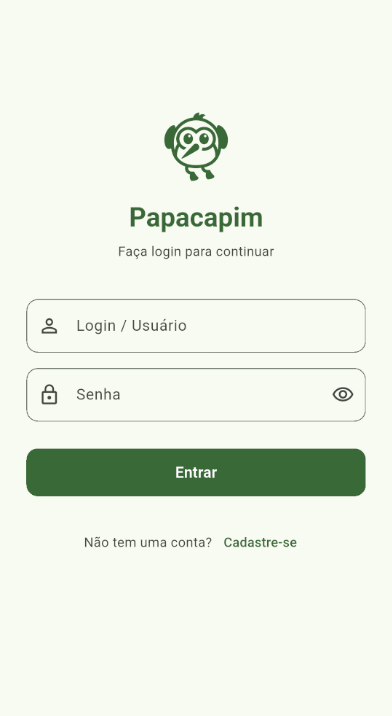
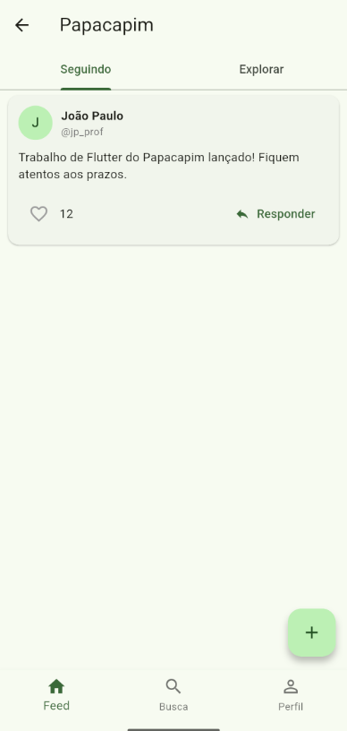
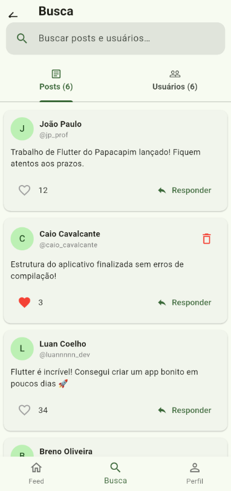
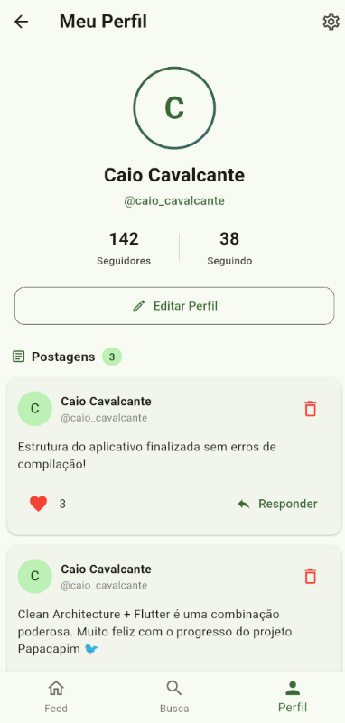

# 🚀 Papacapim - Rede Social Mobile

> Uma aplicação mobile moderna em Flutter desenvolvida para a rede social Papacapim, como projeto de avaliação da disciplina de Desenvolvimento Mobile (IFBA-FSA, BSI, 7° Semestre) sob orientação do Prof. João Paulo Just Peixoto.

[](https://flutter.dev)
[](https://dart.dev)
[](LICENSE)
[](#-conformidade-com-os-requisitos-pdf)

---

## 📝 Sumário
- [Sobre o Projeto](#-sobre-o-projeto)
- [Desenvolvedores](#-desenvolvedores)
- [Conformidade com os Requisitos (PDF)](#-conformidade-com-os-requisitos-pdf)
- [Interface do Aplicativo](#-interface-do-aplicativo)
- [Tecnologias Utilizadas](#-tecnologias-utilizadas)
- [Funcionalidades](#-funcionalidades)
- [Primeiros Passos](#-primeiros-passos)
  - [Pré-requisitos](#pré-requisitos)
  - [Instalação](#instalação)
- [Como Executar](#-como-executar)
- [Roadmap](#-roadmap)
- [Licença](#-licença)
- [Contato](#-contato)

---

## 🧐 Sobre o Projeto

O **Papacapim** é um aplicativo mobile de rede social desenvolvido em **Flutter** para simular e consumir as funcionalidades da API do Papacapim (`api.papacapim.just.pro.br`). 

O desenvolvimento do trabalho foi dividido pelo docente em duas etapas principais:
1. **Parte 1: Design da Interface**: Prototipação completa das telas, componentes visuais de alta fidelidade e fluxos de navegação simulados com dados fictícios.
2. **Parte 2: Implementação das Funcionalidades**: Integração completa da aplicação com a API REST backend.

---

## 👥 Desenvolvedores

Projeto desenvolvido em dupla por:
* **Caio Cavalcante Araújo**
* **Maria Luiza Machado Costa**

---

## ✅ Conformidade com os Requisitos (Parte 1: Design da Interface)

Tabela detalhada comprovando o cumprimento de 100% dos requisitos exigidos no documento oficial de avaliação ([Projeto Mobile - 2026.1.pdf](Projeto%20Mobile%20-%202026.1.pdf)):

| Requisito do PDF | Descrição Solicitada | Pontuação | Status |
| :--- | :--- | :---: | :---: |
| **Tela de login** | Tela com campos de login e senha para acessar a rede | 1,0 | ✅ Concluído |
| **Tela de cadastro** | Tela com campos de nome, login, senha e confirmação de senha para cadastrar | 1,0 | ✅ Concluído |
| **Tela de feed** | Tela com as postagens, separadas entre postagens dos perfis que o usuário segue e outras que o back-end envia | 1,0 | ✅ Concluído |
| **Tela de busca** | Tela para buscar posts (conteúdo do post) e usuários (pelo login) | 1,0 | ✅ Concluído |
| **Tela de perfil de usuário** | Foto, nome, login, número de seguidos, número de seguidores, botão editar perfil e botão seguir/deixar de seguir | 1,0 | ✅ Concluído |
| **Tela de alteração de dados** | Tela com campos de nome e senha para alterar, além de botão para alterar a foto e excluir perfil | 1,0 | ✅ Concluído |
| **UI de seleção de foto (Galeria)** | Interface que seleciona uma foto da galeria do celular | 1,0 | ✅ Concluído |
| **UI de tirar foto (Câmera)** | Interface que tira uma foto com a câmera para usar como perfil | 1,0 | ✅ Concluído |
| **Tela de postagem** | Tela com um campo de texto para escrever a postagem e botão de enviar | 1,0 | ✅ Concluído |
| **Botão de curtir e descurtir post** | Botão para curtir/descurtir um post no feed | 0,4 | ✅ Concluído |
| **Botão de responder post** | Botão no post no feed para escrever uma resposta em forma de post | 0,3 | ✅ Concluído |
| **Botão de excluir post** | Botão para excluir post que só aparecerá nos posts do próprio usuário | 0,3 | ✅ Concluído |

---

## 📱 Interface do Aplicativo

<p align="center">
  
  
  
  
</p>

---

## 🛠️ Tecnologias Utilizadas

- **Framework**: [Flutter](https://flutter.dev/) (SDK ^3.9.2)
- **Linguagem**: [Dart](https://dart.dev/)
- **Design System**: Material Design 3 (com suporte a temas modernos e responsivos)
- **Backend API**: Documentada em [api.papacapim.just.pro.br](http://api.papacapim.just.pro.br)

---

## ✨ Funcionalidades

- **Autenticação**: Telas intuitivas de login e registro com validação de campos.
- **Feed Dinâmico**: Organização entre postagens gerais e de perfis seguidos.
- **Busca em Tempo Real**: Filtro e pequisa por conteúdos de postagens e usuários pelo login.
- **Perfis de Usuário**: Exibição completa de contadores (seguidores/seguindo), foto, dados cadastrais e opções para seguir/deixar de seguir.
- **Gestão de Perfil**: Tela de edição de dados pessoais e gerenciamento da foto de perfil (Galeria ou Câmera).
- **Interatividade no Feed**: Criação de novas postagens, publicação de respostas encadeadas, curtidas/descurtidas e exclusão de publicações próprias.

---

## 🏁 Primeiros Passos

Siga as instruções abaixo para executar o projeto localmente em seu ambiente de desenvolvimento.

### Pré-requisitos
* Flutter SDK (versão 3.x ou superior) instalado e configurado nas variáveis de ambiente.
* Dart SDK (compatível com ^3.9.2).
* Emulador Android/iOS ou dispositivo físico com depuração ativada.

### Instalação
1. Clone este repositório:
   ```sh
   git clone https://github.com/caio-cavalcante/papacapim.git
   ```
2. Acesse o diretório do frontend:
   ```sh
   cd papacapim/frontend
   ```
3. Instale as dependências:
   ```sh
   flutter pub get
   ```

---

## 🚀 Como Executar

Para iniciar o aplicativo em seu emulador ou dispositivo conectado:

```sh
flutter run
```

---

## 🗺️ Roadmap

- [x] **Parte 1: Design da Interface** (Prototipação, Telas, Navegação e Mock Data)
- [ ] **Parte 2: Implementação das Funcionalidades**
  - [ ] Integração com a API de Autenticação (Login / Cadastro)
  - [ ] Consumo do Feed e Atualização por Arraste (*Pull to Refresh*)
  - [ ] Requisições para Criação, Resposta, Exclusão e Curtidas de Posts
  - [ ] Atualização de Dados do Perfil e Upload de Fotos no Backend
  - [ ] Integração de Busca e Ação de Seguir/Deixar de Seguir no Backend

---

## 📄 Licença

Distribuído sob a Licença MIT. Veja o arquivo [LICENSE](LICENSE) para mais informações.

---

## ✉️ Contato

* **Caio Cavalcante Araújo** - [LinkedIn](https://www.linkedin.com/in/caio-cav-ara)
* **Maria Luiza Machado Costa**
